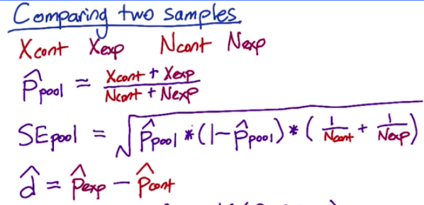

# Testing the Efficacy of a New Modal Window

> Make design decisions for an A/B test, including which metrics to
> measure and how long the test should be run. Analyze the results of an
> A/B test that was run by Udacity and recommend whether or not to
> launch the change.

In an experiment, Udacity tested a change for the user-flow how students can register for their nanodegree. If the student clicked "start free trial", they were asked how much time they had available to devote to the course:

If the student indicated 5 or more hours per week, they would be taken through the checkout process as usual. If they indicated fewer than 5 hours per week, a message would appear indicating that Udacity courses usually require a greater time commitment for successful completion, and suggesting that the student might like to access the course materials for free. The reason for this experimental modal window is to separate the wheat from the chaff. In other words, the *hypothesis* is if a student knows from the beginning that they don’t have enough time to finish the degree, then they shouldn’t even register. If the modal window is effective it is going to kill two birds with a stone. From the user’s perspective, less students are going to have a bad user experience due to high expectations. From Udacity’s perspective, instructors would invest less time in drop-outs and thus were more able to focus on students which are

– probably – not going to drop out.

# Experiment Design

## Metric Choice

The *unit of diversion* is a cookie, although if the student enrolls in the free trial, they are tracked by user-id from that point forward. dmin indicates for each metric the minimum difference between control and experimental group to be considered as practically significant. In total, there are seven metrics at our disposal:

1. **Number of cookies:** That is, number of unique cookies to view the course overview page. (dmin=3000)

2. **Number of user-ids:** That is, number of users who enroll in the free trial. (dmin=50)

3. **Number of clicks:** That is, number of unique cookies to click the "Start free trial" button (which happens before the free trial screener is trigger). (dmin=240)

4. **Click-through-probability ( = #clicks/#pageviews):** That is, number of unique cookies to click the "Start free trial" button divided by number of unique cookies to view the course overview page. (dmin=0.01)

5. **Gross conversion (= #enrollment/#clicks):** That is, number of user-ids to complete checkout and enroll in the free trial divided by number of unique cookies to click the "Start free trial" button. (dmin= 0.01)

6. **Retention (= #payment/#enrollment):** That is, number of user-ids to remain enrolled past the 14-day boundary (and thus make at least one payment) divided by number of user-ids to complete checkout. (dmin=0.01)

7. **Net conversion (= #payment/#clicks):** That is, number of user-ids to remain enrolled past the 14-day boundary (and thus make at least one payment) divided by the number of unique cookies to click the "Start free trial" button. (dmin= 0.0075)

## Invariant Metrics

Since **number of cookies** and **number of clicks **are determined before the modal window is triggered, these two metrics should be invariant. As **Click-through-probability **is the relation between the two, thus this metric is per definition also invariant.

## Evaluation Metrics

As our modal window might be considered as a caution to potential students, we assume less people actually enrol/checkout, but more people stay enrolled after passing the 14-day boundary. Numbers of checkout is the numerator of **gross conversion** and denominator of **retention. **Hence, if the checkouts decrease, the **gross conversion** should also decrease. However, **retention **should increase as less people checkout and more people stay as they now have better understanding of the time commitment. If the number remaining students actually increases, **net conversion **must also increase. In other words there ought be a smaller gap between gross and net conversion.

## Not considered

Students are tracked by their user-ids from the point they enrol (s. above). As we expect to see a change in the enrolment-rate after the modal-window is triggered for the experiment group, **number of user-ids **is** **definitely not invariant. It thus seems to be an inferior evaluation metric in comparison to gross conversion as the latter is a ratio of enrollments to clicks (measured by number of user-ids) and thus *normalised* by our unit of diversion. Consequently, different control and experiment group sizes are not problematic.

## When to Launch

We are going to launch the modal window if:

1. Gross conversion decreases more than the significant boundary (dmin = 0.01)

2. Net conversion *doesn’t* decrease below the significant boundary (dmin = 0.0075)

3. Retention rate *doesn’t* decrease below the significant boundary (dmin = 0.01)

## Measuring Standard Deviation

Out metrics are probabilities. Thus, we are going to use the formula **sqrt(p*(1-p)/N)** for calculating the standard deviations. The baseline probabilities are as follows:

<table>
  <tr>
    <td>Probability of enrolling, given click</td>
    <td>0.20625</td>
  </tr>
  <tr>
    <td>Probability of payment, given enroll</td>
    <td>0.53</td>
  </tr>
  <tr>
    <td>Probability of payment, given click	</td>
    <td>0.1093125</td>
  </tr>
</table>

The sample size of **5000 **is given. The baseline click-through-probability on "Start free trial" is **0.08**:

<table>
  <tr>
    <td>N for gross conversion</td>
    <td>5000 * 0.08 = 400</td>
  </tr>
  <tr>
    <td>N for retention</td>
    <td>5000 * 0.08 * 0.20625 = 82.5</td>
  </tr>
  <tr>
    <td>N for net conversion	</td>
    <td>5000 * 0.08 = 400</td>
  </tr>
</table>

Which results to:

<table>
  <tr>
    <td>SD for gross conversion</td>
    <td>0,020230604</td>
  </tr>
  <tr>
    <td>SD for retention</td>
    <td>0,054949012</td>
  </tr>
  <tr>
    <td>SD for net conversion	</td>
    <td>0,015601545</td>
  </tr>
</table>

As gross conversion and net conversion are using cookies as a denominator, the *unit of analysis* and *unit of diversion* is equal – which is the cookie. Hence, the empirical and analytical variability should be close.

For retention rate it’s different as the unit of diversion "number of students enrolled” whereas the unit of analysis is user-ids. However, they should be still close as it’s highly unlikely for a user to enrol twice.

## Sizing

### Number of Samples vs. Power

We are not going to use a Bonferroni correction as we are only going to launch the modal window when all of our metrics are practically and statistically significant. This fact makes our research design conservative enough.

For the sample size, we are going to use the [sample size calculator](http://www.evanmiller.org/ab-testing/sample-size.html) given by the instructors (in our case with alpha = 0.05, beta = 0.8):

* Sample size for gross conversion: we need 25,835 clicks on the modal window as clicks is our unit of analysis. To receive this amount of clicks, we need 25,835/0.08 = 322,937.5 page views *per group*. 0.08 is our baseline click through probability. In total, this means **645,875**.

* Sample size for retention rate: we need 39,115 enrollments as enrollment is our unit of analysis. In other words, we need  39,115 /(0.08*0.20625) = 2,373,030 page views per variation, totalling **4,746,061**. 0.20625 is the probability of enrolling per given click.

* Sample size for net conversion: we need 27,413 clicks on the modal window. The unit of analysis is the same as for gross conversion. Thus 27,413/0.08 =  342,662.5 page views for each group is necessary. In total this means **685,325**.

### Duration vs. Exposure

As this experiment doesn’t have any physical and psychological risks on the users, respectively, diverting **100%** of the traffic should not be an issue from the user’s perspective. Furthermore, no sensitive information is tracked. From Udacity’s perspective there might be a tiny risk if the modal window surprisingly causes a heavy drop of checkouts.

However, using the **whole** traffic bears the advantage to finish the experiment sooner and thus we should accept the risk – especially, if the experiment should not take more than a few weeks (as required by the instructors). We need to divide the necessary sample size by our daily pageviews:

* Gross conversion: 645,875/40,000 is 17 days, which is fine.
* Retention rate: 4,746,061/40,000**
* Net conversion: 685,325/40,000 is a 18 days which is still fine.

**is 176 days, which is definitely too long.

The amount of 176 days is definitely too much to consider it as a few weeks. Consequently, we are going to drop the retention rate as an evaluation metric and merely stick to gross and net conversion. Besides, we are going to add three days to the minimum necessary days. In other words, the experiment is then rounded up to exactly three week (18 + 3 = 21 days). In doing so, we eliminate any bias regarding visitor behaviour towards weekdays or weekends.

# Experiment Analysis

## Sanity Checks

### Confidence Intervals

We expect the number of cookies and clicks to split evenly between the control and experimental group (i.e., 50%) because we intend to split our web traffic evenly. Besides, there shouldn’t be any difference click-through-probability, so we expect 0% here. As requested, we check the confidence interval for a 95% two tailed test (i.e., **z = 1.96**). We are going to determine p_pool and SE_pool:

<table>
  <tr>
    <td>Invariant Metric</td>
    <td>Observed Value</td>
    <td>Lower Bound</td>
    <td>Upper Bound</td>
    <td>Sanity Check passed?</td>
  </tr>
  <tr>
    <td>number of cookies</td>
    <td>0.5006</td>
    <td>0.4983</td>
    <td>0.5030</td>
    <td>yes</td>
  </tr>
  <tr>
    <td>number of clicks</td>
    <td>0.5005</td>
    <td>0.4922</td>
    <td>0.5087</td>
    <td>yes</td>
  </tr>
  <tr>
    <td>Difference in click-through-probability</td>
    <td>0.0001</td>
    <td>-0.0012</td>
    <td>0.0013</td>
    <td>yes</td>
  </tr>
</table>

## Result Analysis

### Effect Size Tests

* The rate of gross conversion in our control and experimental group is 0.2189 and 0.1983, respectively. The difference is thus 0.1983 -  0.2189 = **-0.0206 **(rounded).

* The rate of net conversion in our control and experimental group is 0.1176 and 0.1127, respectively. The difference is thus 0.1127 -  0.1176 = **-0.049 **(rounded).

* For alpha = 0.05 and Z = 1.96 this means:

<table>
  <tr>
    <td>Metric</td>
    <td>Practical Significance</td>
    <td>Observed difference</td>
    <td>Lower Bound</td>
    <td>Upper Bound</td>
    <td>SE_
Pool</td>
    <td>Result</td>
  </tr>
  <tr>
    <td>gross conversion</td>
    <td>(-)0.01</td>
    <td>-0.020555</td>
    <td>-0.029123</td>
    <td>-0.011986</td>
    <td>0.004372</td>
    <td>Statistically and practically passed</td>
  </tr>
  <tr>
    <td>net conversion</td>
    <td>(-)0.075</td>
    <td>-0.004874</td>
    <td>-0.011605</td>
    <td>0.0018572</td>
    <td>0.003434</td>
    <td>Both not passed</td>
  </tr>
</table>

### Sign Tests

For **alpha = 0.05** the results are*:

<table>
  <tr>
    <td>Metric</td>
    <td>Sign Test p-Value</td>
    <td>Statistically Significant?</td>
  </tr>
  <tr>
    <td>gross conversion</td>
    <td>0.002599</td>
    <td>yes</td>
  </tr>
  <tr>
    <td>net conversion</td>
    <td>0.6776</td>
    <td>no</td>
  </tr>
</table>

*R was used binom.test(x, n, p = 0.5, alternative = c("two.sided", "less", "greater"), conf.level = 0.95)with n = 23 and x = 4 and 13, respectively.

### Summary

As mentioned above, we didn’t use a Bonferroni correction. If we have had used a Bonferroni correction, the likelihood of a type II (false negative) error would have had increased.

There’s no discrepancy between the effect size hypothesis test and sign test. Both indicate a practical and statistical significance for gross conversion but NOT for net conversion.

## Recommendation

The requirement for launching the modal window was that both metrics ought to be significant.

The decrease of gross conversion is indeed practically and statistically significant. However, for net conversion our results are neither statistically nor practically significant. Not statistically, as the confidence interval contains zero. Not practically, as the lower bound of the confidence interval (-0.11605) is below dmin = -0.0075, which bears the risk that net conversion decreases more than our set boundary.   Concluding, we are 95% confident that if a modal window is launched, a decrease in enrollment **not** coupled to an increase in students staying enrolled occurs. 

We should thus not launch the modal window – for now.

# Follow-Up Experiment

It might be that the modal window somehow created a friction in the gross conversion process or users got intimidated by the time commitment. A new experiment should be conducted which starts after the enrolment. My idea is to show write a follow-up email *after* subscribing which includes the time commitment and a motivational video (e.g., "this where you can be in a year with just a weekly 5-hour-commitment").

Hypothesis: Users stay longer enrolled (and thus pay) if they receive a motivational video after their enrolment.

* Unit of diversion: User Id. As soon as, users are enrolled, they are going to be diverted either to the control group or experiment group

* Invariant metric: Enrollments. As the experiment starts after enrolling, the number of enrollments should not be affected.

* Evaluation metric: Retention rate. Retention is defined as #payment/#enrollment. As we are interested if more people stay enrolled and thus pay after reading/watching the motivational video, retention rate is an adequate metric.
